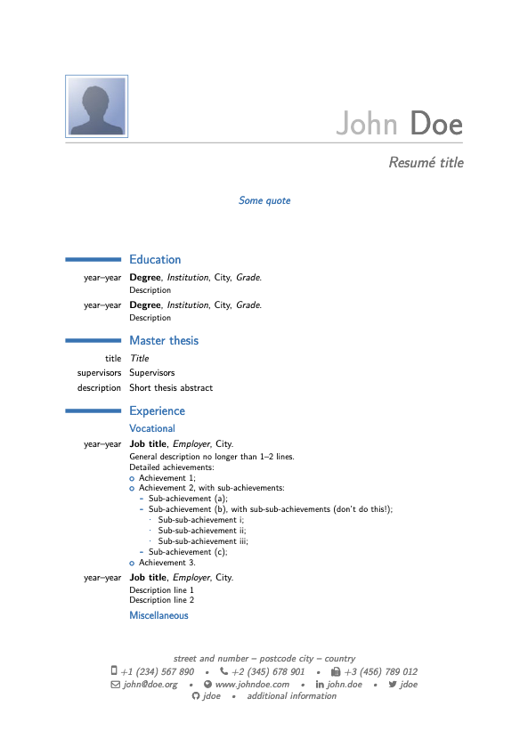

# Nixpkgs ModernCV

Repository which builds [moderncv](https://ctan.org/pkg/moderncv?lang=en)
documents using [nixpkgs](https://nixos.org/).

This repository can be used as a template to create a (private) repository
which can automatically generate PDFs from the LaTeX document in tagged
releases.

[Example of PDF generated from template.tex](https://github.com/rgoulter/nixpkgs-moderncv/releases/download/v1.0/template.pdf).



## Setup

Follow the instructions for [installing Nix](https://nixos.org/guides/install-nix.html)

```
sh <(curl -L https://nixos.org/nix/install) --daemon
```

or

```
curl -o install-nix-2.3.8 https://releases.nixos.org/nix/nix-2.3.8/install
curl -o install-nix-2.3.8.asc https://releases.nixos.org/nix/nix-2.3.8/install.asc
gpg2 --recv-keys B541D55301270E0BCF15CA5D8170B4726D7198DE
gpg2 --verify ./install-nix-2.3.8.asc
# then: $ sh ./install-nix-2.3.8
```

## Building PDF

With Nix installed, building e.g. `resume.tex` in the current directory can
be done with:

```
./nix-build-with-document.sh resume
```

with the resulting PDF ending up in `./result/resume.pdf`.

Alternatively, you can enter a shell that can build the LaTeX documents by running:

```
nix-shell
```

then:

```
[nix-shell:~/nixpkgs-moderncv]$ xelatex resume.tex
```

to generate `resume.pdf` in the current directory.

## GitHub Action

The GitHub Action workflow defined in `.github/workflows` will build and
upload the generated PDF for tags which start with `v`. e.g. `v1.0`.
